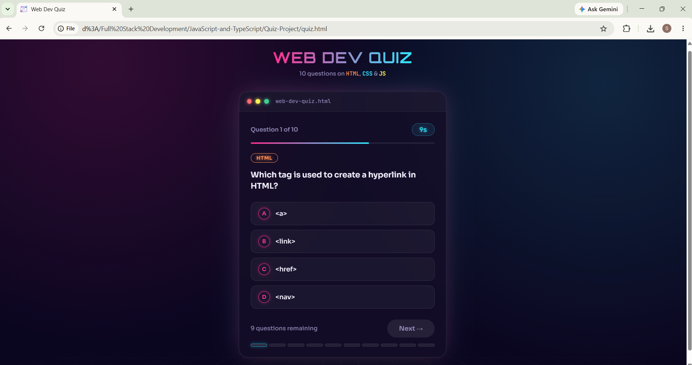

<div align="center">

# Project : Web Dev Quiz

**A simple and interactive JavaScript application that tests your knowledge of **HTML**, **CSS**, and **JavaScript** through a 10-question timed quiz with a neon, synthwave-inspired interface. This project demonstrates the use of JavaScript timing functions, DOM manipulation, arrays, and ES6 features to create a dynamic, game-like user experience.**

</div>

---

## 📑 Table of Contents

- [Project Description](#-project-description)
- [How This Project is Made](#-how-this-project-is-made)
- [Features](#-features)
- [Technologies Used](#-technologies-used)
- [JavaScript Concepts Covered](#-javascript-concepts-covered)
- [How It Works](#-how-it-works)
- [Project Structure](#-project-structure)
- [Screenshot](#-screenshot)
- [Demo](#-demo)
- [Author](#-author)

---

## 📌 Project Description

The Web Dev Quiz is built using **HTML**, **CSS**, and **JavaScript**. It presents 10 multiple-choice questions covering HTML, CSS, and JavaScript fundamentals, with a 15-second timer per question, instant answer feedback, and a final score screen.

This project is designed to strengthen JavaScript fundamentals through practical implementation of timers, event handling, and dynamic content updates.

---

## 🚀 How This Project is Made

This project is built using HTML, CSS, and JavaScript to create an interactive **Web Dev Quiz Application**.

### 🧱 HTML Structure
- Basic structure is created using semantic HTML elements.
- Sections include the quiz card (with a window-chrome style header), the options list, the footer with progress tracking, and a separate result card.

### 🎨 CSS Styling
- A neon synthwave theme is built using CSS custom properties, gradients, and glow effects.
- An animated grid floor and glowing card border give the page a distinctive visual identity.
- Flexbox is used for layout alignment throughout.
- CSS keyframe animations power the timer pulse, card-flip transitions, and correct/wrong flash feedback.
- `prefers-reduced-motion` is respected to disable animations for users who prefer reduced motion.
- Responsive design ensures the layout adapts to smaller screens.

### ⚙️ JavaScript Functionality
- Questions are stored as an array of objects, each with a category, question text, options, and the correct answer index.
- Arrow functions and template literals are used for cleaner code.
- `setInterval()` is used to run the **15-second per-question countdown timer**.
- `clearInterval()` stops the timer once an answer is selected or time runs out.
- `setTimeout()` is used to automatically advance to the next question after the timer expires, and to control transition timing between questions.
- DOM manipulation dynamically builds the options list, updates the progress indicator, and reveals correct/incorrect answers.
- Event listeners handle option selection, manual "Next" clicks, and the "Retake Quiz" action.

---

## ✨ Features

- 10-question quiz covering HTML, CSS, and JavaScript
- 15-second timer per question with a live countdown display
- Automatically advances to the next question when time runs out
- Manual "Next" / "Finish" button after answering
- Instant answer feedback with color-coded correct (✓) and wrong (✕) highlighting
- Color-coded category tags for HTML, CSS, and JavaScript questions
- Segmented progress bar showing completed, current, and upcoming questions
- Glowing flash effect on the card for correct and wrong answers
- Final score screen with percentage and a performance-based message
- "Retake Quiz" option to restart from the beginning
- Fully responsive, neon-themed user interface

---

## 🔧 Technologies Used

- HTML5
- CSS3
- JavaScript (ES6)

---

## 📚 JavaScript Concepts Covered

- Arrays of objects
- Loops (`for`, `forEach`)
- Functions
- Arrow Functions
- Template Literals
- DOM Manipulation
- Event Listeners
- Conditional Statements
- `setTimeout()`
- `setInterval()`
- `clearInterval()` / `clearTimeout()`

---

## 🔄 How It Works

### ⏱️ Timer & Auto-Advance
- Each question starts a 15-second countdown using `setInterval()`.
- If the timer reaches zero, the correct answer is revealed and the quiz automatically advances using `setTimeout()`.
- If the user answers manually, the timer stops immediately with `clearInterval()`.

### 🏷️ Category Tags
- Every question displays a colored tag — orange for HTML, blue for CSS, yellow for JavaScript — based on its category.

### 📊 Progress Segments
- A row of 10 segments shows quiz progress: completed questions are filled, the current question pulses, and upcoming questions remain dim.

### ✅ Answer Feedback
- Selecting an option locks all choices, highlights the correct and/or incorrect answer, and triggers a glowing flash around the card.

### 🏆 Score & Retake
- After the final question, a score screen displays the result as a fraction and percentage, along with a performance message.
- The "Retake Quiz" button resets the score and questions to start over.

---

## 📂 Project Structure

```text
Web-Dev-Quiz/
│
├── assets/
│   ├── output.png
│   └── quiz.png
│
├── index.html
├── style.css
├── script.js
└── README.md
```

---

## 📸 Screenshot



---

## 🎬 Demo

| | |
|---|---|
| 🔗 Live Demo                 | https://fullstack-web-dev-quiz.netlify.app/ |
| 🎥 Project Explanation Video | https://drive.google.com/file/d/1qxCGEkntRGptnljaiWyfpCIYVIg5hYxh/view?usp=sharing |
| 🎥 Project Recording | https://drive.google.com/file/d/1W2haHAd4owW7zcWEbxuExAEmmb_wWrWE/view?usp=sharing |

---

## 💻 Author

<div align="center">

**Sakina Sendhi**

[](https://github.com/sakinasendhi52)

⭐ Thank you for visiting this repository!

</div>
